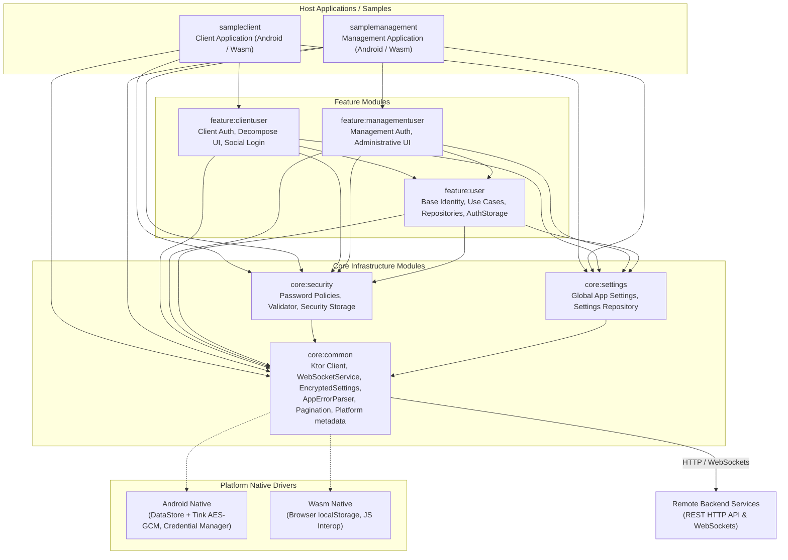
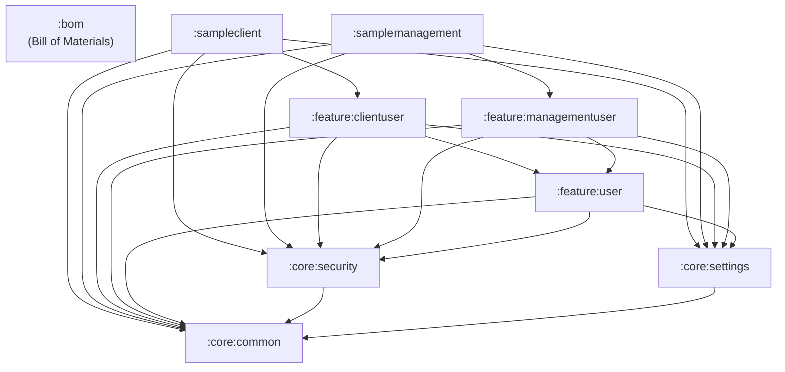

# KMP Platform SDK Architecture

This document describes the high-level architecture, multiplatform design principles, and module dependency graph of the `kmp-platform-sdk`.

For detailed domain models, component relationships, and sequence diagrams of specific runtime processes, please refer to the specialized documentation in the `docs/architecture` directory:

- **[Identity & Access Domain Models](docs/architecture/identity_and_access.md)** — Core models: User Application Types (`AppType`), User Roles (`UserRole`), Account Statuses (`UserAccountStatus` with State Machine), User Identifiers (`UserIdentifier`), Sessions & Tokens (`UserSession`), and Step-up MFA Challenge handling.
- **[SDK Bootstrap & Component Initialization](docs/architecture/flows/sdk_bootstrap.md)** — Manual DI startup sequence, component wiring (`CommonComponent`, `ClientUserComponent`), network interceptor plugins, error parser registration, and initial synchronization.
- **[Authentication & Token Refresh](docs/architecture/flows/authentication.md)** — Multi-provider authentication (Email/Password, Phone OTP, Google Sign-In via Credential Manager/JS Interop), encrypted token persistence, and synchronized `401 Unauthorized` token refresh (`AuthHttpClientConfigPlugin`).
- **[Error Handling & Parsing Pipeline](docs/architecture/flows/error_handling.md)** — `AppResult` pattern, `AppError` taxonomy (`CommonError`, `SecurityError`, `UserError`), Chain of Responsibility parsing (`AppErrorParser`), and Compose string resource resolution.
- **[WebSocket Synchronization](docs/architecture/flows/websockets.md)** — `WebSocketService` lifecycle, token-aware connection management, ping/pong heartbeats, message handler routing (`WebSocketMessageHandler`), and reactive cache invalidation.
- **[Security & Password Policy / TOTP / Unlock](docs/architecture/flows/security.md)** — Dynamic password policy validation (`PasswordPolicyValidator`), TOTP MFA lifecycle (setup, QR code, recovery codes), and account recovery (`UnlockRootComponent` for `SECURITY_HOLD`).
- **[Account & Profile Management Flows](docs/architecture/flows/account_management_flows.md)** — Active sessions listing & remote revocation, identifier linking & OTP code throttling (`ConfirmationRepository`), password changes, and account deletion scheduling & grace period restoration.
- **[Encrypted Storage & Platform Infrastructure](docs/architecture/flows/storage_and_platform.md)** — `EncryptedSettings` abstraction across targets (Android DataStore + Google Tink vs Wasm `localStorage`), platform metadata (`DeviceInfoProvider`), external launchers, and pagination infrastructure (`PaginationState`).

---

## 1. High-Level Architecture

The platform is designed as a modular Kotlin Multiplatform (KMP) client SDK targeting Android and Web (Wasm). It provides a unified foundation for networking, encrypted storage, security policies, and identity management. By combining **Compose Multiplatform** UI with **Decompose** component navigation, host applications can integrate complete authentication and management flows with minimal boilerplate.

---

## 2. Module Dependency Graph

The project enforces strict layer boundaries. `core:common` is the foundational leaf module that must never depend on any `feature/*` modules. Feature modules depend on core primitives and `core:common`. Host applications aggregate the entire graph at the composition root. All module version alignments are maintained via the `:bom` Bill of Materials.

