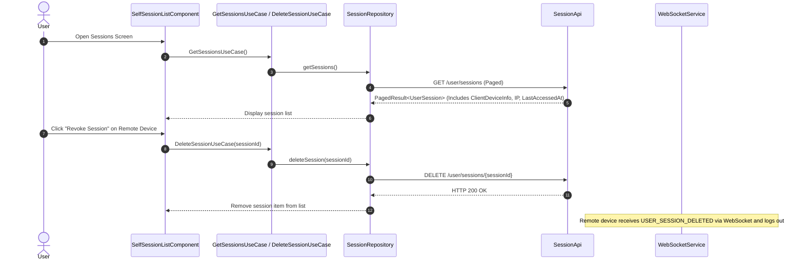
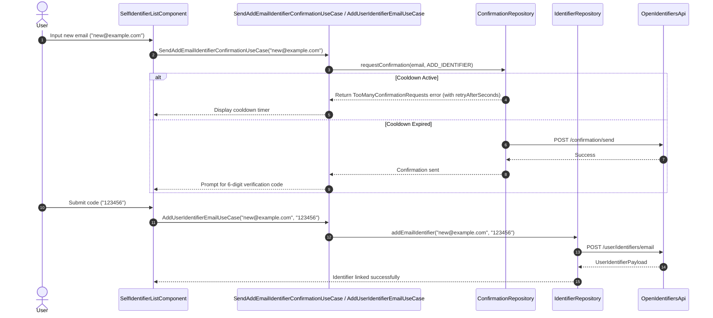
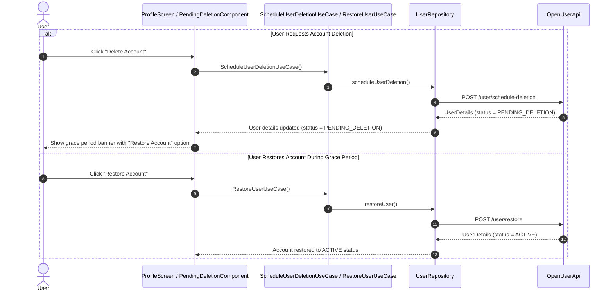

# Account & Profile Management Flows

This document describes profile updates, active session management, identifier (email/phone) linking, and account deletion and restoration workflows in `kmp-platform-sdk`.

---

## 1. Profile Management Architecture

Profile management is centralized in `ProfileRootComponent` (`feature/user`). The component uses Decompose stack navigation to host:
- `MainProfileComponent`: Overview of profile details, account status, security settings, and legal links.
- `SelfSessionListComponent`: Active sessions list with remote revocation controls.
- `SelfIdentifierListComponent`: Identifiers list (emails, phone numbers, social accounts) with add/remove capabilities.
- `TotpMainComponent`: TOTP 2FA setup and recovery code management.

---

## 2. Active Session Management & Revocation Flow

Users can inspect all devices where their account is currently authenticated:

---

## 3. User Identifiers Linking & Confirmation Throttling

Adding a new identifier (email address or phone number) requires OTP code confirmation:

---

## 4. Account Deletion & Restoration Flow

