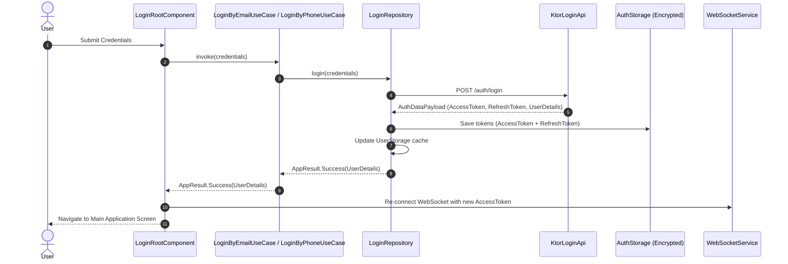
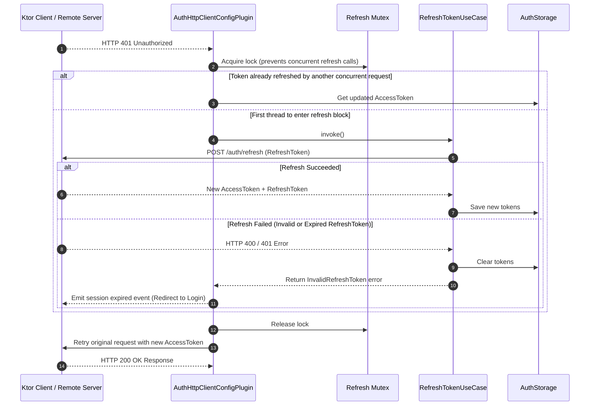

# Authentication & Token Refresh Flow

This document describes the multi-provider authentication flows, token storage, and the transparent access token refresh mechanism provided by `kmp-platform-sdk`.

---

## 1. Authentication Overview

The SDK supports flexible multi-provider authentication:
- **Email & Password**: Direct login (`LoginByEmailUseCase`) or registration with confirmation codes (`SendRegistrationConfirmationToEmailUseCase`, `RegistrationByEmailUseCase`).
- **Phone OTP**: Login or registration via SMS verification codes (`SendLoginConfirmationToPhoneUseCase`, `LoginByPhoneUseCase`).
- **Google Sign-In**: Platform-native authentication using Jetpack Credential Manager on Android (`AndroidUserAuthServices`) and Google Identity Services JS Interop on Wasm (`WasmUserAuthServices`).
- **TOTP / MFA**: Secondary authentication step when TOTP is enabled on the user account (`LoginByTotpUseCase`, `LoginByTotpRecoveryCodeUseCase`).

---

## 2. Authentication Sequence Diagram

---

## 3. Synchronized Token Refresh Flow (`AuthHttpClientConfigPlugin`)

When an HTTP API request fails with `401 Unauthorized`, `AuthHttpClientConfigPlugin` handles token renewal transparently without interrupting the user experience.

---

## 4. Multi-Platform Social Auth Implementations

- **Android (`AndroidUserAuthServices`)**: Interacts with `CredentialManager` to request Google ID tokens securely from the Android system credential provider.
- **Wasm (`WasmUserAuthServices`)**: Uses Kotlin/JS interop to render the Google Sign-In button and handle ID token callbacks from Google Identity Services in the browser viewport.
