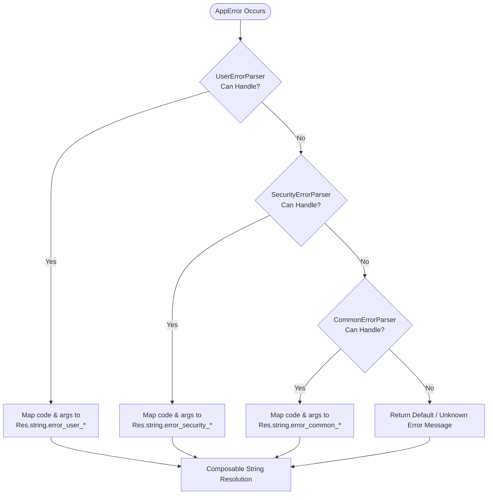

# Error Handling & Parsing Pipeline Flow

This document describes the unified error modeling, Chain of Responsibility parsing pipeline, and Compose string resolution architecture in `kmp-platform-sdk`.

---

## 1. Overview & Result Pattern

The SDK standardizes operation outputs using `AppResult<T>` (`Success` or `Error`). Errors implement `AppError`, providing:
- `id`: Unique `ErrorId` (wrapping `Uuid`) generated per error instance for tracking across layers.
- `code`: Stable, machine-readable error code string (e.g., `CommonErrorCodes.INTERNAL`, `ClientUserErrorCodes.TOO_MANY_CONFIRMATION_REQUESTS`).
- `args`: Key-value map of dynamic metadata (e.g. `retryAfterSeconds`, `passwordMinLength`).
- `isRetryable`: Boolean indicating whether the operation can be safely retried by the user.

---

## 2. Error Taxonomy Hierarchy

```mermaid
classDiagram
    class AppError {
        <<interface>>
        +ErrorId id
        +String code
        +Map~String, String~? args
        +Boolean isRetryable
    }

    class CommonError {
        <<sealed class>>
    }
    class SecurityError {
        <<sealed class>>
    }
    class UserError {
        <<sealed class>>
    }

    AppError <|-- CommonError
    AppError <|-- SecurityError
    AppError <|-- UserError

    class CommonErrorUnknown["CommonError.Unknown"]
    class CommonErrorInternal["CommonError.Internal"]
    class CommonErrorNoInternet["CommonError.NoInternetConnection"]
    class CommonErrorNetwork["CommonError.Network"]
    class CommonErrorContractViolation["CommonError.ContractViolation"]

    CommonError <|-- CommonErrorUnknown
    CommonError <|-- CommonErrorInternal
    CommonError <|-- CommonErrorNoInternet
    CommonError <|-- CommonErrorNetwork
    CommonError <|-- CommonErrorContractViolation

    class SecurityPasswordPolicyUnavailable["SecurityError.PasswordPolicyUnavailable"]
    class SecurityPasswordTooShort["SecurityError.PasswordTooShort"]
    class SecurityPasswordNoLetter["SecurityError.PasswordNoLetter"]

    SecurityError <|-- SecurityPasswordPolicyUnavailable
    SecurityError <|-- SecurityPasswordTooShort
    SecurityError <|-- SecurityPasswordNoLetter

    class UserInvalidRefreshToken["UserError.InvalidRefreshToken"]
    class UserExternalAuthCancelled["UserError.ExternalAuthCancelled"]
    class UserTooManyConfirmationRequests["UserError.TooManyConfirmationRequests"]

    UserError <|-- UserInvalidRefreshToken
    UserError <|-- UserExternalAuthCancelled
    UserError <|-- UserTooManyConfirmationRequests
```



---

## 3. AppErrorParser Chain of Responsibility Pipeline

Errors are parsed into user-facing, localized strings using `AppErrorParserBuilder`. Specialized feature parsers take precedence, falling back to `CommonErrorParser`.



---

## 4. UI Error String Resolution in Compose

Within `@Composable` UI components, error messages are resolved dynamically using `LocalErrorParser` from `CompositionLocalProvider`:

```kotlin
val parser = LocalErrorParser.current
val errorMessage = parser.parse(appError) ?: stringResource(Res.string.error_common_unknown)

FullscreenError(
    message = errorMessage,
    onRetry = if (appError.isRetryable) { { retryOperation() } } else null
)
```

---

## 5. Diagnostic Logging via Kermit

All `AppError` instances support detailed diagnostic logging using Kermit integration (`AppError.log()`):
- Logs the error class, `ErrorId`, `code`, dynamic `args`, and associated underlying `Throwable` stack traces for internal or network failures.
