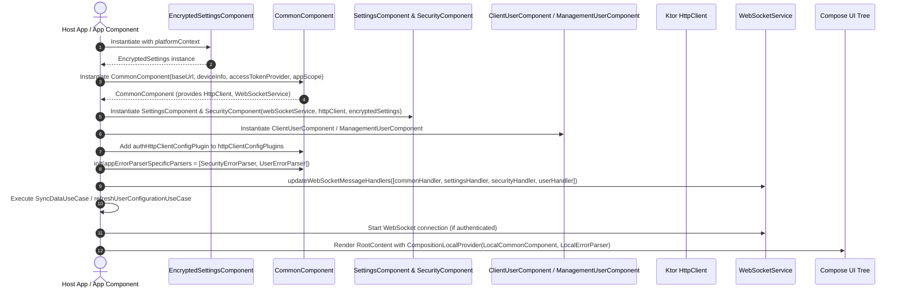

# SDK Bootstrap & Component Initialization Flow

This document details the startup sequence, manual dependency injection hierarchy, plugin registration, and initial state synchronization in the `kmp-platform-sdk`.

---

## 1. Overview

The SDK utilizes a modular, component-based dependency injection approach centered around Decompose components and manual assembly. The host application (e.g. `sampleclient` or `samplemanagement`) initializes core infrastructure first, attaches feature modules, installs network interceptors and error parsers, and performs initial data synchronization before launching the UI tree.

---

## 2. Initialization Flow Diagram

---

## 3. Step-by-Step Initialization Sequence

### Step 1: Storage Layer Assembly
The host app initializes `EncryptedSettingsComponent` with target-specific context (`platformContext`):
- **Android**: Uses Jetpack DataStore encrypted via Google Tink AES-GCM.
- **Wasm**: Uses browser `localStorage` wrapper.

### Step 2: Root Infrastructure Assembly (`CommonComponent`)
`CommonComponent` is instantiated as the single source of truth for base network HTTP/WebSocket execution, platform metadata (`PlatformRepository`), error parsing pipeline (`AppErrorParser`), and coroutine scope (`appScope`).

### Step 3: Domain Components Assembly
Feature components are constructed by passing `CommonComponent` dependencies:
- `SettingsComponent`: Global application settings management.
- `SecurityComponent`: Backend password policies and validation.
- `ClientUserComponent` / `ManagementUserComponent`: Authentication, token persistence (`AuthStorage`), identity, and user profile management.

### Step 4: System Wiring (`init()` Phase)
Before invoking any network operations or UI rendering:
1. **Network Interceptor Registration**: `authHttpClientConfigPlugin` from `ClientUserComponent` / `ManagementUserComponent` is registered in `commonComponent.httpClientConfigPlugins`.
2. **Error Parser Chain Assembly**: `commonComponent.init()` is invoked with `SecurityErrorParser` and `UserErrorParser`.
3. **WebSocket Handler Routing**: Domain-specific `WebSocketMessageHandler` implementations are registered in `WebSocketService`.

### Step 5: Startup Data Synchronization
The application invokes initial synchronization use cases (e.g., `SyncDataUseCase` / `refreshUserConfigurationUseCase`) to load global settings, security policies, and user details in parallel into encrypted local caches.

### Step 6: UI Injection
The assembled components are injected into the Compose Multiplatform hierarchy using `CompositionLocalProvider`:
- `LocalCommonComponent`
- `LocalErrorParser`
- `LocalClientAppComponent` / `LocalManagementAppComponent`
