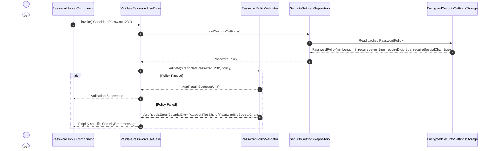
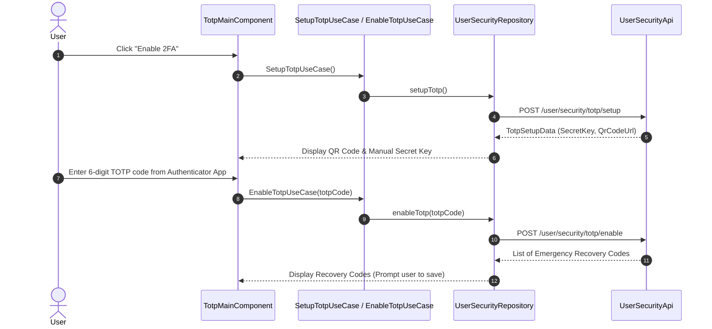

# Security & Password Policy / TOTP / Unlock Flows

This document details password policy validation, Time-based One-Time Password (TOTP) MFA lifecycle, and account recovery flows within `kmp-platform-sdk`.

---

## 1. Backend-Driven Password Policy Validation

The SDK enforces configurable password rules supplied dynamically by the backend via `core:security`:

---

## 2. TOTP MFA Lifecycle Flow

Users manage Two-Factor Authentication via `TotpMainComponent` in `feature/user`:

---

## 3. Account Unlock Flow (`SECURITY_HOLD` Recovery)

When an account enters `SECURITY_HOLD` due to failed attempt thresholds or suspicious logins, standard authentication is blocked until the recovery flow is completed:

1. **Detection**: `LoginByEmailUseCase` or `LoginByPhoneUseCase` receives `UserAccountStatus.SECURITY_HOLD`.
2. **Navigation**: Decompose router navigates to `UnlockRootComponent`.
3. **Target Selection**: User chooses recovery delivery method (Email OTP or Phone SMS OTP) via `UnlockMethodSelectionComponent`.
4. **Verification**: User enters OTP code received via chosen delivery method.
5. **Account Restoration**: Upon successful OTP submission, account status transitions back to `ACTIVE`, issuing a fresh session token pair.
