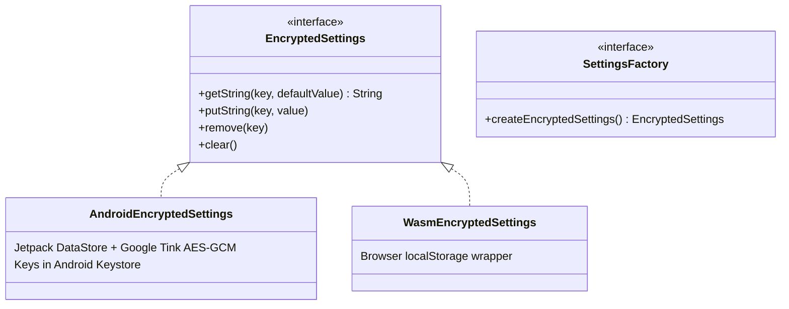
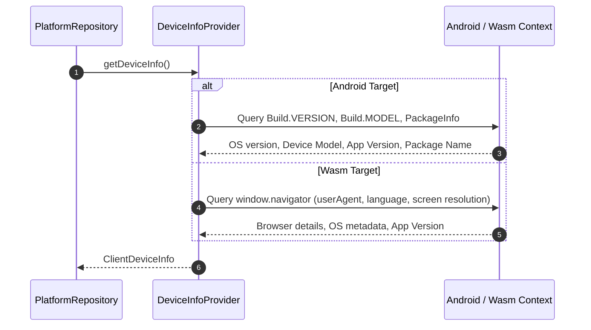

# Encrypted Storage & Platform Infrastructure Flow

This document details target-specific encrypted storage abstractions, platform metadata resolution, external system integration, and pagination infrastructure in `kmp-platform-sdk`.

---

## 1. Encrypted Storage Multiplatform Abstraction (`EncryptedSettings`)

The SDK mandates secure client persistence via `EncryptedSettings` (`core:common`), isolating domain logic from platform-specific APIs.

### Storage Backends
- **Android (`AndroidEncryptedSettings`)**: Built on Jetpack DataStore and Google Tink. Master encryption keys are stored securely in Android Keystore (AES-256-GCM), encrypting all key-value entries before writing to disk.
- **Wasm (`WasmEncryptedSettings`)**: Encapsulates browser `localStorage` to handle web target persistence.

---

## 2. Platform Metadata Resolution (`DeviceInfoProvider`)

`PlatformRepository` collects immutable hardware and environment metadata via platform actuals:

`ClientDeviceInfo` is automatically attached to HTTP headers and WebSocket initialization payloads to maintain audit trails on the backend.

---

## 3. External System Interactions (`ExternalLauncher`)

Platform-native actions (opening web browsers, launching mail clients, or opening local file URIs) are unified behind `ExternalLauncher`:
- **Android**: Dispatches `Intent.ACTION_VIEW` or `Intent.ACTION_SENDTO`, using `FileProvider` for safe file URI sharing.
- **Wasm**: Interops with `window.open` or `window.location.href`.

---

## 4. Listing & Pagination Infrastructure

For infinite scrolling lists (sessions, identifiers, audit logs), the SDK provides standardized pagination building blocks in `core:common`:

- **State Container (`PaginationState<T>`)**: Tracks cumulative list items, current page, loading flags, error state, and reached-end sentinel.
- **Scroll Monitoring (`OnBottomReached`)**: Extension on `LazyListState` that detects scroll proximity to the bottom of a list and fires a callback to fetch the next page.
- **UI Footer (`PagingFooter`)**: Standard composable added as the last item of a `LazyColumn` to render loading indicators or retry buttons for failed pages.
