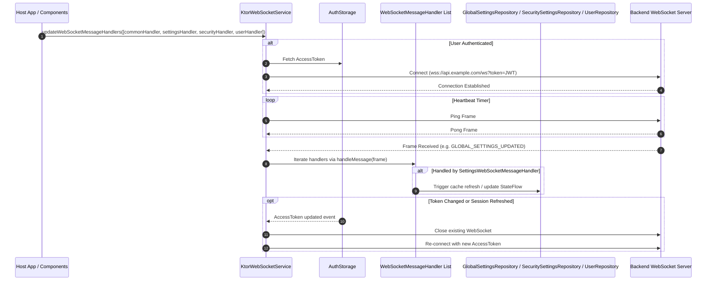

# WebSocket Lifecycle & Real-Time Synchronization Flow

This document describes connection management, ping/pong heartbeats, message handler routing, and reactive cache invalidation driven by WebSockets in `kmp-platform-sdk`.

---

## 1. Overview

Real-time synchronization across client modules is powered by `WebSocketService` (`KtorWebSocketService`). The service maintains a active WebSocket connection to the backend, appending the current `AccessToken` as a query parameter. When events occur on the server (e.g. global settings updated, user session revoked, profile edited), frames are received and dispatched to registered `WebSocketMessageHandler` instances.

---

## 2. WebSocket Connection Lifecycle & Message Routing

---

## 3. WebSocket Message Handlers Breakdown

| Handler | Domain Events | Action Taken |
| :--- | :--- | :--- |
| **`CommonWebSocketMessageHandler`** | Frame PING, PONG, INIT | Manages system heartbeats and framework-level acknowledgments. |
| **`SettingsWebSocketMessageHandler`** | `GLOBAL_SETTINGS_UPDATED` | Triggers background refresh of `GlobalSettingsStorage` and updates `globalSettings` `StateFlow`. |
| **`SecurityWebSocketMessageHandler`** | `SECURITY_SETTINGS_UPDATED` | Triggers background refresh of `SecuritySettingsStorage` and re-evaluates `PasswordPolicyValidator`. |
| **`UserWebSocketMessageHandler`** | `USER_UPDATED`, `USER_SESSION_DELETED`, `USER_IDENTIFIER_UPDATED` | Updates `UserStorage` cache, invalidates current session if deleted, and pushes fresh `UserDetails` to subscribers. |

---

## 4. Reactive State Propagation

Repositories combine encrypted local storage with WebSocket event listeners:
1. Initial state is served immediately from `EncryptedSettings` (cache-first).
2. When a WebSocket update frame arrives, the handler invalidates or updates the encrypted cache in memory and storage.
3. Repositories emit updated domain models via Kotlin `StateFlow`, causing UI composables observing the flow to recompose automatically.
