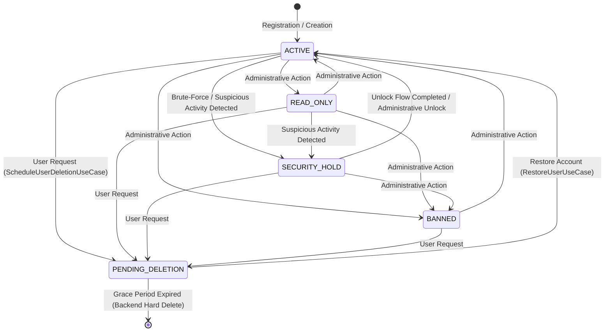

# Identity & Access Domain Models

This document defines the core domain entities, access models, and state machines that govern identity, authentication, authorization, and session management within the `kmp-platform-sdk`.

---

## 1. User Application Types (`AppType`)

The SDK categorizes client applications into two distinct operational contexts:

- **`CLIENT`**: Standard end-user applications (built via `feature:clientuser`). Focuses on public onboarding, multi-method login, self-service profile management, personal session control, and self security settings.
- **`MANAGEMENT`**: Internal administrative portals (built via `feature:managementuser`). Focuses on privileged access, administrative user oversight, cross-account session revocation, resource inspection, and audit trail verification.

---

## 2. User Roles (`UserRole`) & Permissions

Roles define the broad authorization tier assigned to a user account on the backend:

- **`USER`**: Standard end-user account. Grants access to consumer features via public APIs.
- **`STAFF`**: Employee or moderator account with operational privileges for management tools.
- **`ADMIN`**: Superuser with complete system access, configuration controls, and administrative user management.

The SDK enforces role constraints on the client side by selecting the appropriate feature component (`ClientUserComponent` vs `ManagementUserComponent`) and validating response contracts.

---

## 3. Account Statuses (`UserAccountStatus`)

An account's status overrides its role and dictates whether the user can authenticate or perform state-mutating actions.

- **`ACTIVE`**: Fully functional account with unrestricted access.
- **`READ_ONLY`**: Account is restricted to read operations. Mutations return localized contract/permission errors.
- **`BANNED`**: Complete restriction. Active sessions are invalidated immediately, and authentication requests are rejected.
- **`SECURITY_HOLD`**: Automatically applied when suspicious activity or brute-force attempts are detected. Authentication requires completing the specialized `UnlockRootComponent` recovery flow (email/SMS OTP verification).
- **`PENDING_DELETION`**: The user scheduled account deletion. The account enters a grace period during which the user can log in to restore the account via `PendingDeletionComponent` (`RestoreUserUseCase`) or allow permanent deletion by the backend.

### Account Status State Machine

---

## 4. User Identifiers (`UserIdentifier`)

An identifier represents a login credential attached to a core `UserId`.

- **Providers (`UserAuthProvider`)**: `EMAIL`, `PHONE`, `GOOGLE`, `APPLE`, etc.
- **Domain Identity**: Represented by `UserIdentifier` with a unique `UserIdentifierId` (value class wrapping `Uuid`).
- **Uniqueness & Verification**: Each provider + identifier combination (e.g. `EMAIL` + `user@example.com`) is globally unique. Identifiers require confirmation via code verification (email OTP or SMS OTP) before transitioning to a verified state.
- **Management in SDK**: Users can view, add, and remove identifiers via `SelfIdentifierListComponent`. Adding a new identifier requires confirmation code verification managed by `ConfirmationRepository`.

---

## 5. User Sessions (`UserSession`) & Token Lifecycle

A session represents an authenticated login instance on a specific device.

- **Token Pair**: Consists of a short-lived `AccessToken` (JWT string used for HTTP Bearer auth and WebSocket query params) and a long-lived `RefreshToken` persisted securely in `AuthStorage`.
- **Device Metadata**: Captures OS version, device model, app version, and platform type via `ClientDeviceInfo` (`DeviceInfoProvider`).
- **Session Identification**: Identified by `UserSessionId` (value class wrapping `Uuid`).
- **Lifecycle & Revocation**:
  - Automatically refreshed via `RefreshTokenUseCase` when `AuthHttpClientConfigPlugin` intercepts a 401 Unauthorized response.
  - Users can list active sessions (`SelfSessionListComponent`) and terminate specific remote sessions (`DeleteSessionUseCase`) or all other sessions (`DeleteAllOtherSessionsUseCase`).
  - Server-driven session invalidation is pushed in real time via WebSockets (`USER_SESSION_DELETED` frame), triggering local token purge and navigation to the login screen.

---

## 6. Step-up Authentication & MFA Challenge Handling

Sensitive actions (such as account deletion, password changes, or updating security settings) may require secondary verification:

- **MFA Challenge Interception**: `MfaStepUpHttpClientConfigPlugin` monitors API responses for MFA step-up requirements (HTTP status 403 with MFA challenge payload).
- **Interactive Verification**: The plugin delegates to `DefaultMfaChallengeHandler` / `MfaChallengeDialog`, displaying an overlay prompt for TOTP or recovery code entry.
- **Transparent Retry**: Upon successful challenge verification, the original HTTP request is retried seamlessly without losing user context.
